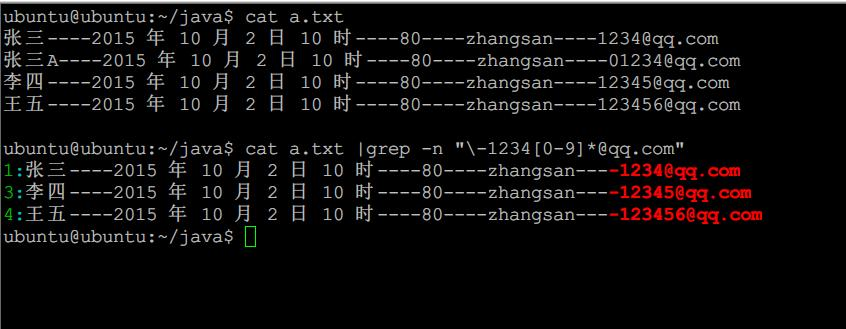

    ubuntu@ubuntu:~/java$ cat a.txt   
    张三----2015 年 10 月 2 日 10 时----80----zhangsan----1234@qq.com   
    张三A----2015 年 10 月 2 日 10 时----80----zhangsan----01234@qq.com   
    李四----2015 年 10 月 2 日 10 时----80----zhangsan----12345@qq.com   
    王五----2015 年 10 月 2 日 10 时----80----zhangsan----123456@qq.com   
      
    ubuntu@ubuntu:~/java$ cat a.txt |grep -n "\-1234[0-9]*@qq.com"  
    1:张三----2015 年 10 月 2 日 10 时----80----zhangsan----1234@qq.com   
    3:李四----2015 年 10 月 2 日 10 时----80----zhangsan----12345@qq.com   
    4:王五----2015 年 10 月 2 日 10 时----80----zhangsan----123456@qq.com   
    ubuntu@ubuntu:~/java$   

PHP原理一样  
1.首先读取一行，然后通过正则 `"\-1234[0-9]*@qq.com"` 来判断是否匹配  

	其中前面 "-" 是为了防止 `0123@qq.com,1123@qq.com` 这两者情况出现的
	后面[0-9]*是表示后面只允许数字出现，* 表示不限制出现次数,如果不限制类型，可以使用
	[\w\W]
2.判断匹配的结果是否有值，有的话则输出   
3.重复1直至读到末尾